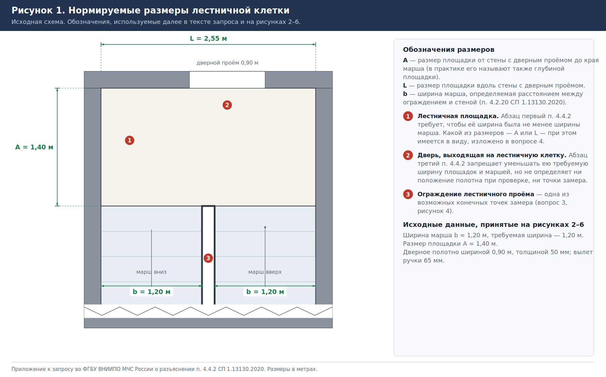
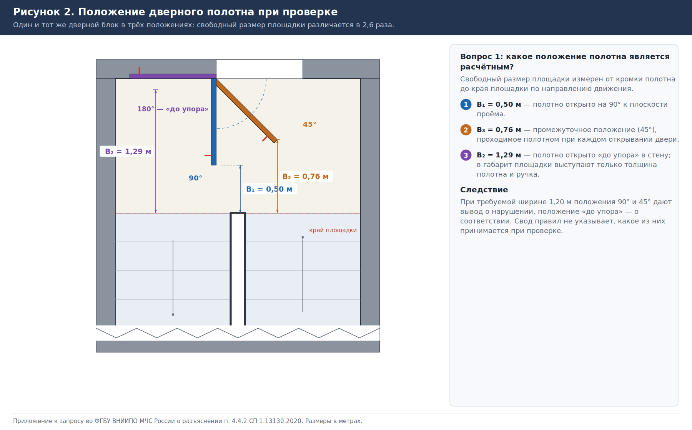
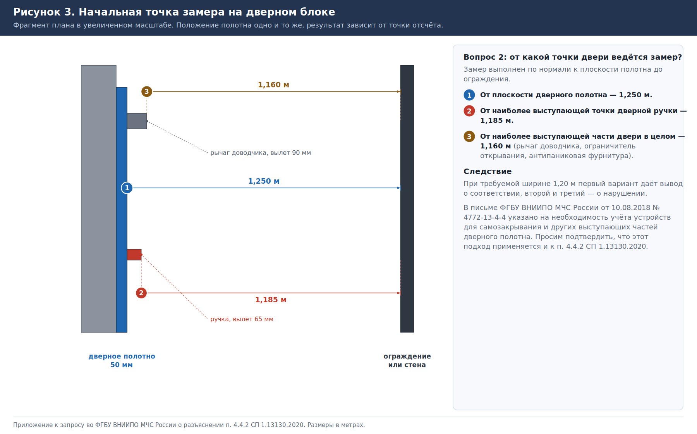
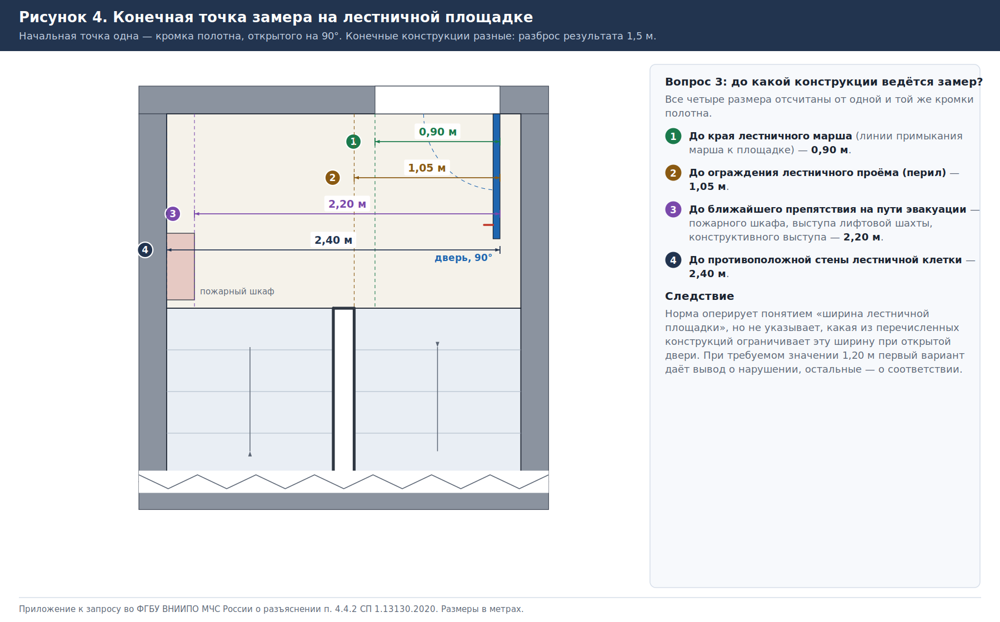
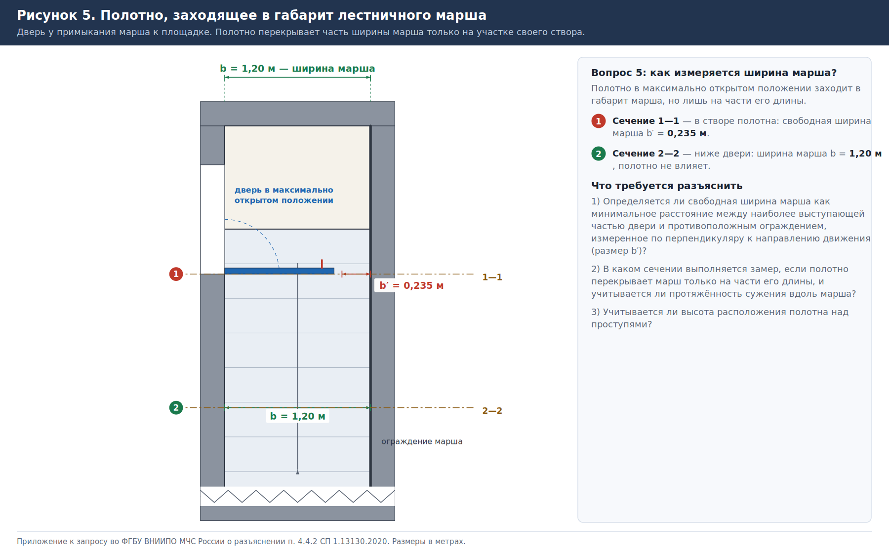
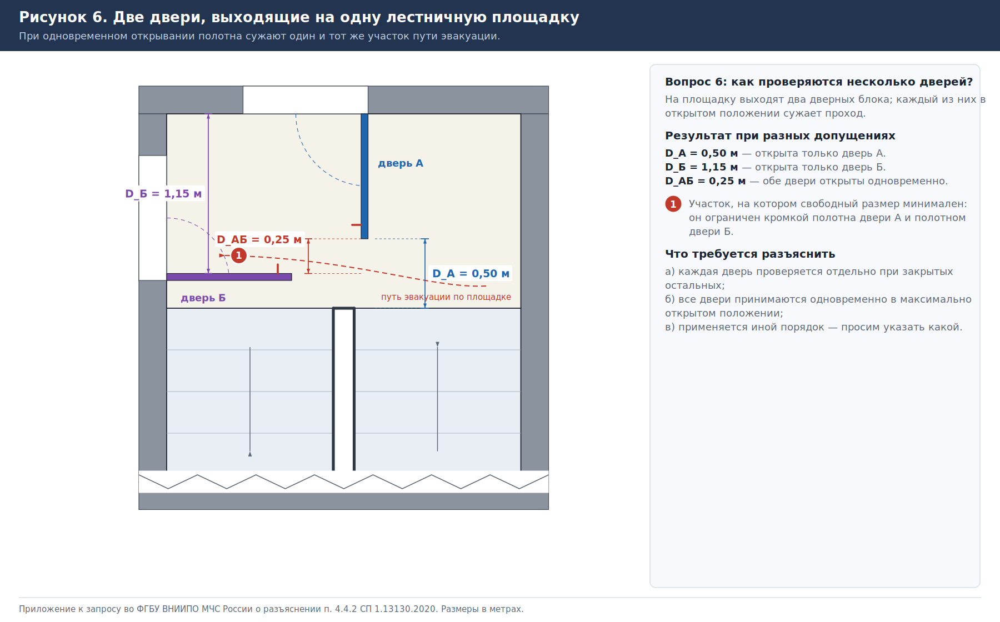

# О порядке измерения ширины лестничных площадок и маршей при дверях, выходящих на лестничную клетку (п. 4.4.2 СП 1.13130.2020)

**Адресат:** ФГБУ ВНИИПО МЧС России, 143903, Московская область, г. Балашиха, мкр. ВНИИПО, д. 12.

> Готовые к отправке файлы — `Письмо_ВНИИПО_п_4_4_2_СП_1_13130_2020.docx` и `Письмо_ВНИИПО_п_4_4_2_СП_1_13130_2020.pdf`. Перед отправкой заполните исходящий номер, реквизиты организации, должность, Ф. И. О., телефон и адрес для ответа.

## Текст письма

Просим дать разъяснение о порядке применения абзаца третьего пункта 4.4.2 СП 1.13130.2020 «Системы противопожарной защиты. Эвакуационные пути и выходы», согласно которому:

> Двери, выходящие на лестничную клетку, в максимально открытом положении не должны уменьшать требуемую ширину лестничных площадок и маршей.

Требование сформулировано как запрет уменьшения нормируемого размера, однако свод правил не устанавливает ни положения дверного полотна, принимаемого при проверке, ни точек, между которыми выполняется измерение. Вследствие этого при разработке проектных решений, экспертизе проектной документации и в ходе надзорных мероприятий по одному и тому же объекту получаются существенно различающиеся результаты замеров и, соответственно, противоположные выводы о соответствии требованиям пожарной безопасности.

Нормируемые размеры и принятые далее обозначения приведены на рисунке 1. Все числовые значения, упомянутые ниже, относятся к этой схеме: ширина марша b = 1,20 м (равна требуемой), размер площадки A = 1,40 м, дверное полотно шириной 0,90 м и толщиной 50 мм с вылетом ручки 65 мм.

Нам известно, что аналогичный вопрос ранее рассматривался применительно к пункту 4.4.3 СП 1.13130.2009. В письме ФГБУ ВНИИПО МЧС России от 10.08.2018 № 4772-13-4-4, а также в разделе «Вопросы и ответы» официального сайта института указано, что «открытое положение» означает максимально возможное открытое положение двери и что при определении требуемой ширины марша необходимо учитывать в том числе устройства для самозакрывания и другие выступающие части дверного полотна. Названные разъяснения устраняют неопределённость лишь частично: они не определяют точки, между которыми выполняется измерение, и не охватывают ситуации, изложенные ниже, вследствие чего на практике продолжают применяться различные методики.

В связи с изложенным просим ответить на следующие вопросы.

**1.** Положение дверного полотна при проверке (рисунок 2). Какое положение принимается расчётным: открывание на 90° к плоскости проёма, при котором свободный размер площадки составляет 0,50 м; максимально возможное открывание «до упора» в стену или ограничитель (1,29 м); либо промежуточное положение, при котором свободный размер минимален (0,76 м при угле открывания 45°)? Если расчётным является максимально открытое положение, просим подтвердить, что промежуточные положения полотна, проходимые им при каждом открывании двери, при проверке не учитываются, несмотря на меньший свободный размер в них.

**2.** Начальная точка замера на дверном блоке (рисунок 3). От какой точки отсчитывается свободный размер: от плоскости дверного полотна (1,250 м), от наиболее выступающей точки дверной ручки (1,185 м) или от наиболее выступающей части двери в целом, включая рычаг доводчика, ограничитель открывания и антипаниковую фурнитуру (1,160 м)? Просим подтвердить, что подход, изложенный в письме от 10.08.2018 № 4772-13-4-4 и предусматривающий учёт устройств для самозакрывания и других выступающих частей полотна, применяется и к пункту 4.4.2 СП 1.13130.2020.

**3.** Конечная точка замера на лестничной площадке (рисунок 4). До какой конструкции выполняется измерение: до края лестничного марша, то есть линии его примыкания к площадке (0,90 м); до ограждения лестничного проёма (1,05 м); до ближайшего препятствия на пути эвакуации — пожарного шкафа, выступа лифтовой шахты, конструктивного выступа (2,20 м); либо до противоположной стены лестничной клетки (2,40 м)?

**4.** Нормируемый размер лестничной площадки (рисунок 1). Какой геометрический параметр площадки имеется в виду в абзаце первом пункта 4.4.2: размер A, измеряемый от стены с дверным проёмом до края марша, или размер L вдоль этой стены? Просим также пояснить соотношение употреблённого в своде правил понятия «ширина лестничной площадки» с параметрами «длина» и «ширина» площадки по ГОСТ 9818-2015 «Марши и площадки лестниц железобетонные. Технические условия», поскольку различие терминологии само по себе является источником разночтений. Подлежат ли контролю с учётом открытой двери оба размера или только один из них?

**5.** Измерение ширины марша, если полотно заходит в его габарит (рисунок 5). Определяется ли в этом случае свободная ширина марша как минимальное расстояние между наиболее выступающей частью двери и противоположным ограждением или стеной, измеренное по перпендикуляру к направлению движения (размер b′ = 0,235 м в сечении 1—1)? Если да, просим пояснить, в каком сечении выполняется замер и учитывается ли протяжённость сужения вдоль марша, так как ниже двери ширина марша сохраняется нормативной (сечение 2—2), а также имеет ли значение высота расположения полотна над проступями.

**6.** Несколько дверей, выходящих на одну площадку (рисунок 6). В каком порядке выполняется проверка, если каждая из дверей в открытом положении уменьшает свободный размер: каждая дверь проверяется отдельно при закрытых остальных (0,50 м и 1,15 м соответственно); все двери принимаются одновременно в максимально открытом положении (0,25 м); либо применяется иной порядок?

**7.** Величина, с которой сравнивается результат замера. С каким значением сопоставляется полученный свободный размер: с минимальной требуемой шириной марша по пункту 4.4.1 СП 1.13130.2020; с фактической проектной шириной марша, если она превышает минимально требуемую; либо с шириной площадки, определённой абзацем первым пункта 4.4.2 (не менее ширины марша, а перед входами в лифты с распашными дверями — не менее суммы ширины марша и половины ширины двери лифта, но не менее 1,6 м)?

Дополнительно просим, если это представляется возможным, изложить общее правило назначения контрольных точек измерения размеров «в свету» для дверей, выходящих на лестничную клетку, применимое к планировочным решениям, не совпадающим с приведёнными на рисунках.

Ответ просим направить по адресу: ____________________________________ либо на адрес электронной почты: ____________________.

Приложение: рисунки 1—6 на 6 л. в 1 экз.

## Приложение. Схемы проведения измерений

### Рисунок 1. Нормируемые размеры лестничной клетки и принятые обозначения

### Рисунок 2. Положение дверного полотна при проверке (к вопросу 1)

### Рисунок 3. Начальная точка замера на дверном блоке (к вопросу 2)

### Рисунок 4. Конечная точка замера на лестничной площадке (к вопросу 3)

### Рисунок 5. Полотно, заходящее в габарит лестничного марша (к вопросу 5)

### Рисунок 6. Две двери, выходящие на одну лестничную площадку (к вопросу 6)

## Использованные разъяснения

- Письмо ФГБУ ВНИИПО МЧС России от 10.08.2018 № 4772-13-4-4 — https://morozofkk.ru/pisma-mchs/id2461/
- Раздел «Вопросы и ответы» официального сайта ВНИИПО — https://www.vniipo.ru/vopros-otvet/sp-1131302009------sistemy-protivopozharnoy-zaschi/
- Экспертный разбор соотношения терминов с ГОСТ 9818 — https://1-12.ru/vopros/id219/
