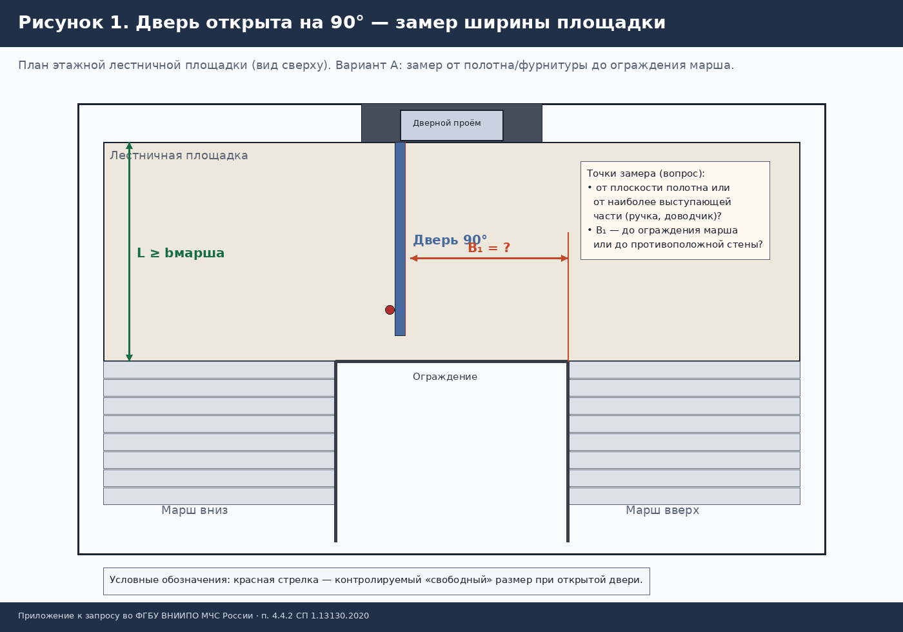
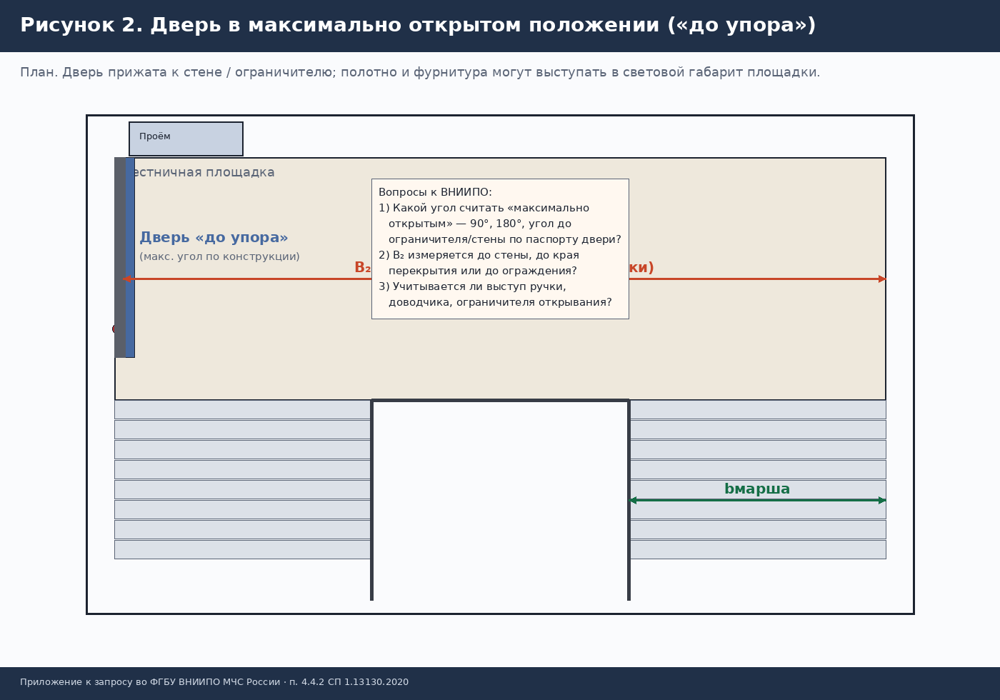
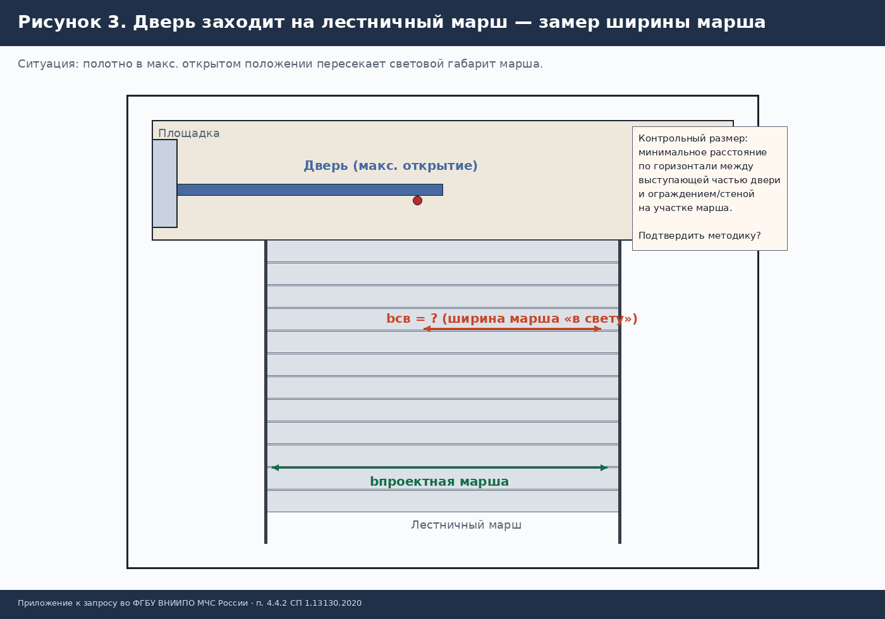
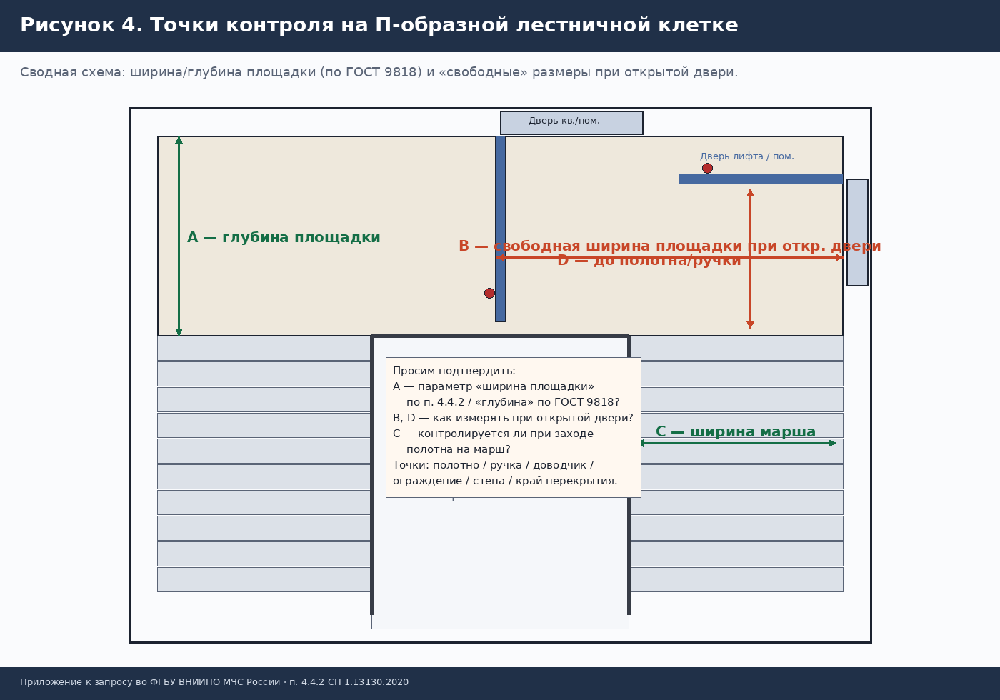
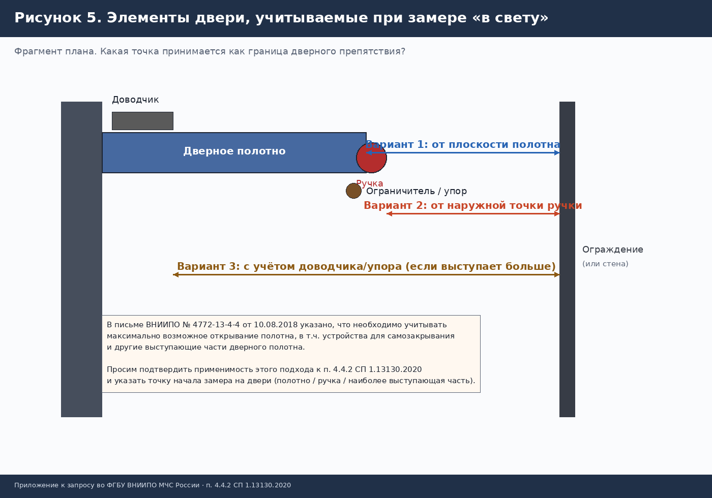
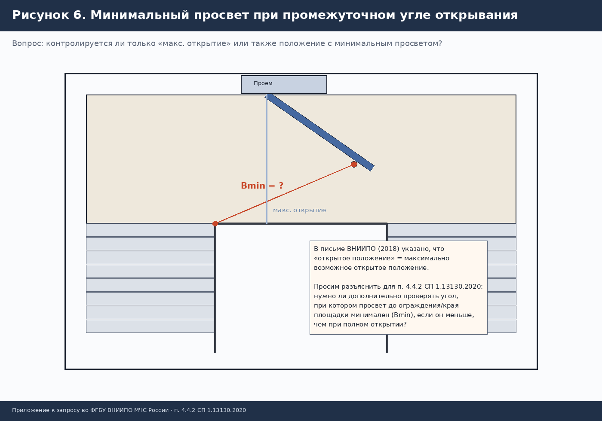

# Письмо во ФГБУ ВНИИПО МЧС России

**Тема:** О разъяснении положений пункта 4.4.2 СП 1.13130.2020 в части измерения ширины лестничных площадок и маршей при максимально открытом положении дверей, выходящих на лестничную клетку

> Файлы для отправки: `Письмо_ВНИИПО_п_4_4_2_СП_1_13130_2020.docx` и `.pdf`. Перед отправкой заполните реквизиты отправителя, исходящий номер, должность и Ф.И.О.

## Адресат

ФГБУ ВНИИПО МЧС России  
143903, Московская область, г. Балашиха, мкр. ВНИИПО, д. 12  
E-mail: vniipo@vniipo.ru

## Текст письма

Просим дать официальное разъяснение порядка применения требования пункта 4.4.2 СП 1.13130.2020, в части: «Двери, выходящие на лестничную клетку, в максимально открытом положении не должны уменьшать требуемую ширину лестничных площадок и маршей».

### Учтённые ранее разъяснения

- Письмо ВНИИПО № 4772-13-4-4 от 10.08.2018 — https://morozofkk.ru/pisma-mchs/id2461/
- Вопросы и ответы ВНИИПО — https://www.vniipo.ru/vopros-otvet/sp-1131302009------sistemy-protivopozharnoy-zaschi/
- Экспертный разбор с отсылкой к ГОСТ 9818 — https://1-12.ru/vopros/id219/

### Рисунки (приложение)

#### Рисунок 1. Дверь открыта на 90° — замер ширины площадки

#### Рисунок 2. Дверь в максимально открытом положении («до упора»)

#### Рисунок 3. Дверь заходит на лестничный марш — замер ширины марша

#### Рисунок 4. Точки контроля на П-образной лестничной клетке

#### Рисунок 5. Элементы двери, учитываемые при замере «в свету»

#### Рисунок 6. Минимальный просвет при промежуточном угле открывания

### Ключевые вопросы к ВНИИПО

1. Что считать «максимально открытым положением» (90°, «до упора», иной критерий) — рис. 1–2.
2. Нужно ли проверять угол с минимальным просветом Bmin — рис. 6.
3. От какой точки двери мерить: полотно / ручка / наиболее выступающая часть — рис. 5.
4. До какой границы площадки мерить: ограждение / стена / край перекрытия / ближайшее препятствие — рис. 1, 2, 4.
5. Что есть «ширина площадки» в п. 4.4.2: размер A или B/D по рис. 4 (связь с ГОСТ 9818).
6. Как мерить ширину марша, если дверь заходит на марш — рис. 3.
7. С какой требуемой величиной сравнивать результат замера (п. 4.4.1 / п. 4.4.2 / проектная ширина).
8. Точки замера для типовых ситуаций на П-образной клетке — рис. 4.
